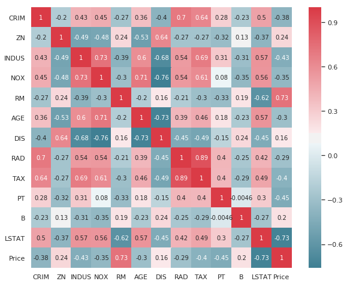
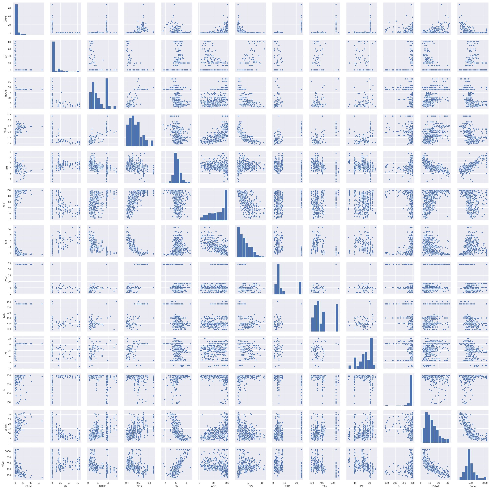

# Python tips and tricks for machine learning

## Data access

### Read data from csv file
Using panda
```python
dataset = pd.read_csv('mydatafile.csv')
```
## Data exploration

### Show average, mean, etc per column
Using the describe method
```python
dataset.describe()
```

### Show correlation between different features of a dataset

#### By numbers in a grid
Use the corr() method, you get a table with all values.
```python
dataset.corr()
```

#### By a heatmap with colors
A heatmap will make things more visual
```python
f, ax = plt.subplots(figsize=(10, 8))
corr = dataset.corr()
sns.heatmap(corr, mask=np.zeros_like(corr, dtype=np.bool), cmap=sns.diverging_palette(220, 10, as_cmap=True), square=True, ax=ax,annot=True)
```


#### By a pairplot, visually showing how fields behave around each other
```python
sns.pairplot(dataset)
```


## Feature engineering

### Remove a column from a dataset
```python
#inplace updates the dataframe 
# axis=1 means column (axis=0 means row)
dataset.drop('COLUMN_NAME', axis=1, inplace=True) 
```

### Replace values in columns
This can be needed to replace male/female, yes/no values by 0 and 1.
```python
dataset['field'] = dataset['field'].replace('yes', 1)
```

### One-hot encoding
When features contain categories (text based), they can be translated into seperate feature (a feature per category), where the feature value will be 0 or 1.  This can be automated, using the following code:

```python
# This inserts the category columns before the output column that we keep at the end
dataset = pd.concat(
    [dataset.iloc[:,0:dataset.columns.size-1],
     pd.get_dummies(dataset['category_feature_name'], prefix='category_feature_name'),
     dataset['outputvalue']],axis=1)
dataset.drop(['category_feature_name'], axis=1, inplace=True)
```
### Add extra (high-norm) features
By adding new features that are combination of each other (distance, surface, weekday), it's possible to implement feature expansion.  

```python
# Inserting the columns in the last but one column (to keep output value in last column)
dataset2  = dataset.copy()
dataset2.insert(dataset2.columns.size-1,'COL1^2',dataset.COL1**2)
dataset2.insert(dataset2.columns.size-1,'COL1^3',dataset.COL1**3)
dataset2.insert(dataset2.columns.size-1,'COL1*COL2',dataset.COL1*dataset.COL2)
```

This can also be automated, so that the package is adding a combination of the existing features for us.  Typically the power should be limited to 3-5, as this can exponentially explode the number of features.

```python
# Automagically add higher order features
from sklearn.preprocessing import PolynomialFeatures
power = 3
poly = PolynomialFeatures(power)
poly.fit(X_train)
X_train_poly = poly.transform(X_train)
X_test_poly = poly.transform(X_test)
```

### Remove outliers
Using the '3-sigma' rule, saying that typically 99,7% of all data is between mean and 3*stddev.

```python
from scipy import stats
# this will replace all outliers and requires every feature to be numeric
dataset = dataset[(np.abs(stats.zscore(dataset)) < 3).all(axis=1)]
# this will only focus on 1 feature
dataset['field'] = dataset['field'][(np.abs(stats.zscore(dataset['field'])) < 3)]
# deleting those outliers can be done with the following code
dataset = dataset.drop(dataset[(np.abs(stats.zscore(dataset['field'])) > 3)].index)
```

### Create features and output sets of dataframe
Easiest is to take the column for the output as y and drop it to keep the X
```python
y = dataset.OutputColumn.values
X = dataset.drop(['OutputColumn'],axis=1)
```

### Split data in training and test set
Using the standard function train_test_split:
Important that the randomization will be used to shift data around (except with time series)
```python
X_train, X_test, y_train, y_test = train_test_split(X, y, test_size=0.33, random_state=0)
```
### Normalize values
Having all feature in the same scale, will make the performance of the Gradient Descent much faster

- **StandardScalar**: The idea behind StandardScaler is that it will transform your data such that its distribution will have a mean value 0 and standard deviation of 1. Given the distribution of the data, each value in the dataset will have the sample mean value subtracted, and then divided by the standard deviation of the whole dataset. Values can be negative, positive and more than 1. ([Stackoverflow post](https://stackoverflow.com/questions/40758562/can-anyone-explain-me-standardscaler#_=_))
    - Good for normal distributed features
    - Good for outliers
    - Does not guarantee same scale for all features (commonly between -3 and +3)
- **MaxAbsScaler**: Scale each feature by its maximum absolute value. This estimator scales and translates each feature individually such that the maximal absolute value of each feature in the training set will be 1.0. Values are between -1 and +1. ([docs](https://scikit-learn.org/stable/modules/generated/sklearn.preprocessing.MaxAbsScaler.html))
- **MinMaxScalar**: Transforms features by scaling each feature to a given range. This estimator scales and translates each feature individually such that it is in the given range on the training set, e.g. between zero and one.  Values depend on the range given ([docs](https://scikit-learn.org/stable/modules/generated/sklearn.preprocessing.MinMaxScaler.html)). 
    - Good when non-Gaussian distribution and small variance.  
    - Skew is kept
    - Outliers are very impactful on the feature!
- **RobustScalar**: much like the MinMaxScalar, but uses the IQR (inter quartile distance) instead of range.  This means the range will be larger than with MinMaxscalar, but is better for outliers.
```python
from sklearn.preprocessing import StandardScaler
scaler = preprocessing.StandardScaler().fit(X_train)  
from sklearn.preprocessing import MaxAbsScaler
scaler = preprocessing.MaxAbsScaler().fit(X_train)   
from sklearn.preprocessing import MinMaxScaler
scaler = preprocessing.MinMaxScaler().fit(X_train) 

X_train = scaler.transform(X_train)
X_test = scaler.transform(X_test)
```

### L1 regularisation Ridge regression (Lasso)
High value can be underfitting - low value of alpha can be overfitting.  Can even exclude certain features (lambda would be 0) , taking absolute value.  Lasso regression not only helps in reducing over-fitting but it can help us in feature selection.

```python
lregmodel = Lasso(alpha=0.1,tol=0.0001,fit_intercept=True)
lregmodel.fit(X_train,y_train)
lregmodel.score(X_test,y_test)
```

### L2 regularisation Ridge regression (Ridge)
Ridge regression shrinks the coefficients and it helps to reduce the model complexity and multi-collinearity.  The higher the alpha value, the more restriction on the coefficients. Low alpha > more generalization, coefficients are barely restricted.

```python
lregmodel = Ridge(alpha=0.020,tol=0.0001,fit_intercept=True)
lregmodel.fit(X_train,y_train)
lregmodel.score(X_test,y_test)
```

## Machine learning models

### Linear regression
Fitting the model:
```python
regression_model = linear_model.LinearRegression()
regression_model.fit(X_train,y_train)
```

The weights and lambda values of the model:
```python
print('coeffs: ',regression_model.coef_)
print('intercept', regression_model.intercept_)
```
Predicting the output, using the model:
```python
feature_values = np.array([0.3, 4, 5])
output = regression_model.predict(feature_values.reshape(1,-1))
# This returns an numpy.ndarray with all output values
```

## Machine learning model evaluation

```python
# Evaluate the model
y_predicted = model.predict(X_test)

## Mean Absolute Error
## Actual meaningful average fault value
from sklearn.metrics import mean_absolute_error
MAE = mean_absolute_error(y_test,y_predicted)

## Mean Squared Error
from sklearn.metrics import mean_squared_error
MSE = mean_squared_error(y_test,y_predicted)

## coefficient of determination = r2 score
## how many variation is defined by the model
## perfect match would be R2=1
## when average of output set is taking, then R2=0
from sklearn.metrics import r2_score
r2 = r2_score(y_test,y_predicted)
```

Reusable function for model prediction
```python
def EvaluateModel(model, X_train, y_train, X_test, y_test, text):
    model.fit(X_train,y_train)
    test_score = model.score(X_test,y_test)
    train_score = model.score(X_train,y_train)
    print(text, 'test score:', '{:.4%}'.format(test_score), 'train score:', '{:.4%}'.format(train_score), 'difference:', '{:.4%}'.format((train_score - test_score)))
```

## Machine learning predict specific instance

```python
input = np.array([0.11, 0, 12.03, 0.57])
output = model.predict(input.reshape(1,-1))
print('The prediction is:' , output[0])
```