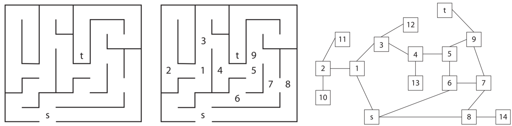
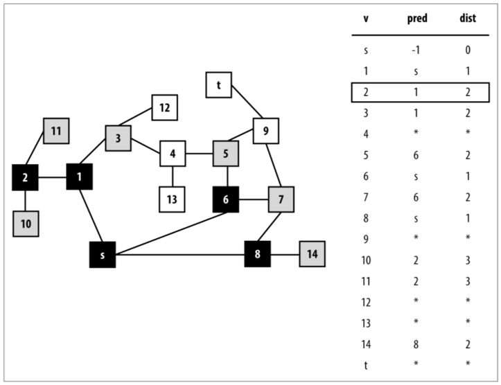
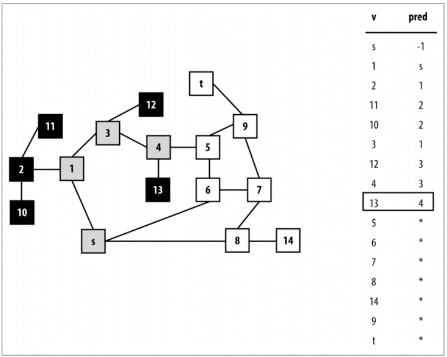
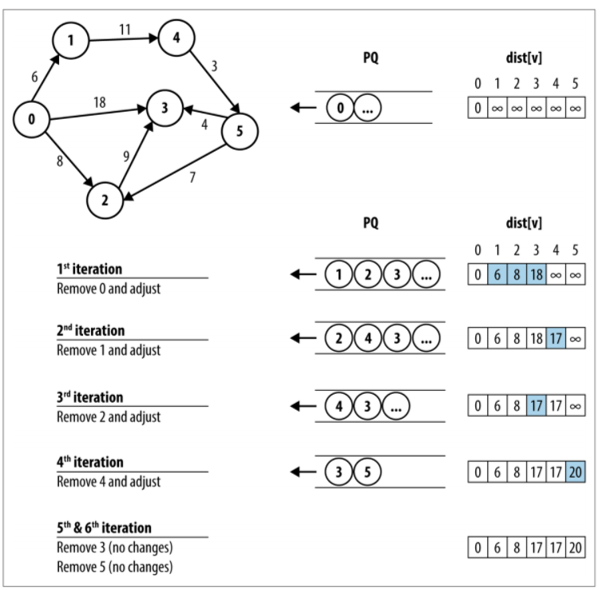

# Exit the maze excercise using graphs

These excercices show algorithms to process graphs etc.

## Source files description

__Algorithms__: [graphsearch.py](../src/04-graph-algorithms/graphsearch.py)

In this file, the 3 different algorithms are being defined, leveraging the graph class, as defined in the [graph.py](../src/04-graph-algorithms/graph.py) file.
These are the most important methods:

- `walk_depth_first(maze, start_vertex_id, target_vertex_id, max_depth = 5)`
  - This method will perform the depth first algorithm (and mostly uses a stack for the traversing of nodes)
  - `maze`: the graph object, representing the maze or nodes that will be used for the search
  - `start_vertex_id`: the id of the start node
  - `target_vertex_id`: the id of the target node the algorithm should navigate to
  - `max_depth`: not used at the moment

- `walk_breadth_first(maze, start_vertex_id, target_vertex_id, max_depth = 5)`
  - This method will perform the breadth first algorithm (and mostly uses a queue for the traversing of nodes)
  - `maze`: the graph object, representing the maze or nodes that will be used for the search
  - `start_vertex_id`: the id of the start node
  - `target_vertex_id`: the id of the target node the algorithm should navigate to
  - `max_depth`: not used at the moment

- `do_the_dijkstra(maze, start_vertex_id, target_vertex_id, max_depth = 5)`
  - This method leverages the Dijkstra algorithm and will guarantee the shortest path (also considering the length of the edges)
  - `maze`: the graph object, representing the maze or nodes that will be used for the search
  - `start_vertex_id`: the id of the start node
  - `target_vertex_id`: the id of the target node the algorithm should navigate to
  - `max_depth`: not used at the moment

__Graph object__: [graphy.py](../src/04-graph-algorithms/graph.py)

This file contains the different classes that are being used to represent a graph.  It uses the adjacant matrix to store all links between the different vertices.  Every edge can get a weight (which is especially used in the Dijkstra algorithm)

__Unit tests__: [test_graph.py](../src/04-graph-algorithms/test_graph.py)

This file contains unit tests to test the different algorithms with different combinations of the mazes, edges and nodes.

## Description

This excercise has to calculate the best possibility to travel through a maze.

The following picture shows the maze, represented as a graph for every possibility.  The different algorithms will search for the moves, needed to get from **s**(tart) to **t**(arget)

### Breadth first

### Depth first

### Dijkstra

